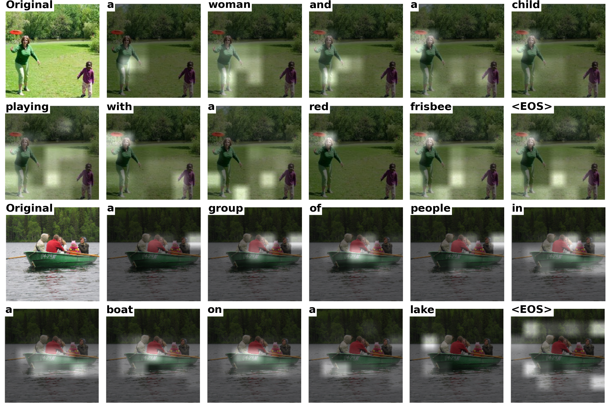

# Generating Narratives with Deep Learning

This repository contains an implementation of image captioning models based on the "Show, Attend, and Tell" paper and extended with transformer-based architectures.

## Project Overview

Image captioning is one of the hallmark challenges of computer vision, requiring a combination of object detection, natural language processing, and context reasoning. This project explores image captioning with two approaches:

1. **LSTM-based Model**: Recreation of the architecture from ["Show, Attend, and Tell"](https://arxiv.org/abs/1502.03044) using a CNN encoder and LSTM decoder with attention mechanism.
2. **Transformer-based Model**: An extension using Vision Transformer (ViT) as encoder and Transformer as decoder to leverage self-attention mechanisms.

## Model Architecture

### LSTM Model

- **Encoder**: Pre-trained ResNet-152 for feature extraction
- **Decoder**: LSTM with Bahdanau (soft) attention mechanism
- **Features**:
  - Attention mechanism to focus on relevant image regions
  - Doubly stochastic attention regularization
  - Beam search for better caption generation

### Transformer Model

- **Encoder**: Vision Transformer (ViT) for image feature extraction
- **Decoder**: Transformer decoder with multi-head self-attention
- **Features**:
  - Self-attention mechanisms for both image and text understanding
  - Parallel computation for faster training
  - Better handling of long-range dependencies

## Datasets

The models are trained and evaluated on three datasets:
- **Flickr8k**: 8,000 images with 5 captions each
- **Flickr30k**: 31,000 images with 5 captions each
- **COCO 2014**: 82,783 training images with 5 captions each

Each dataset is split using the [Andrej Karpathy splits](https://cs.stanford.edu/people/karpathy/deepimagesent/).

## Requirements

```
torch>=1.8.0
torchvision>=0.9.0
pillow>=8.1.0
numpy>=1.19.2
matplotlib>=3.3.4
skimage>=0.18.1
pandas>=1.2.3
```

## Installation

```bash
git clone https://github.com/maldesouky/gt-dl-image-captioning.git
cd gt-dl-image-captioning
pip install -r requirements.txt
```

## Usage

### Data Preparation

The code supports all three datasets (Flickr8k, Flickr30k, and COCO). Scripts are provided to simplify the retrieval of datasets.

### Training

To train the LSTM model on Flickr8k:

```bash
python train_model.py --dataset flickr8k --model lstm --batch_size 64 --learning_rate 1e-3
```

To train the Transformer model on Flickr8k:

```bash
python train_model.py --dataset flickr8k --model transformer --batch_size 64 --learning_rate 1e-3
```

### Caption Generation

To generate captions for images:

```bash
python generate_captions.py --model_path path/to/model.pth --image_folder path/to/images --output_file captions.json
```

To generate captions with attention visualization:

```bash
python generate_saliency_maps.py --model_path path/to/model.pth --image_folder path/to/images --output_folder saliency_maps
```

## Results

Performance comparison on BLEU metrics:

| Dataset  | Model                | BLEU-1 | BLEU-2 | BLEU-3 | BLEU-4 |
|----------|---------------------|--------|--------|--------|--------|
| Flickr8k | Original Paper       | 67.0   | 44.8   | 29.9   | 19.5   |
| Flickr8k | LSTM Recreation      | 60.02  | 42.11  | 28.46  | 18.46  |
| Flickr8k | Modified Transformer | 53.66  | 34.91  | 22.46  | 13.98  |
| Flickr30k| Original Paper       | 66.7   | 43.4   | 28.8   | 19.1   |
| Flickr30k| LSTM Recreation      | 60.55  | 42.60  | 29.41  | 19.98  |
| Flickr30k| Modified Transformer | 44.2   | 25.7   | 15.9   | 10.3   |
| COCO     | Original Paper       | 70.7   | 49.2   | 34.4   | 24.3   |
| COCO     | LSTM Recreation      | 69.07  | 51.41  | 37.13  | 26.07  |

## Files Description

- `CompleteModel.py`: Implementation of the complete image captioning model
- `Decoder.py`: Implementation of LSTM decoder with attention mechanism
- `Encoder.py`: Implementation of CNN encoder using ResNet-152
- `Transformer.py`: Implementation of Vision Transformer encoder and Transformer decoder
- `image_utils.py`: Utility functions for image processing

## Example Output

Here are some examples of the model's output:



## References

1. Kelvin Xu, Jimmy Ba, Ryan Kiros, Kyunghyun Cho, Aaron Courville, Ruslan Salakhudinov, Rich Zemel, and Yoshua Bengio. ["Show, Attend and Tell: Neural Image Caption Generation with Visual Attention"](https://arxiv.org/abs/1502.03044), 2015.
2. Ashish Vaswani, Noam Shazeer, Niki Parmar, Jakob Uszkoreit, Llion Jones, Aidan N. Gomez, Lukasz Kaiser, and Illia Polosukhin. ["Attention is All You Need"](https://arxiv.org/abs/1706.03762), 2017.
3. Alexey Dosovitskiy, Lucas Beyer, Alexander Kolesnikov, Dirk Weissenborn, Xiaohua Zhai, Thomas Unterthiner, Mostafa Dehghani, Matthias Minderer, Georg Heigold, Sylvain Gelly, Jakob Uszkoreit, and Neil Houlsby. ["An Image is Worth 16x16 Words: Transformers for Image Recognition at Scale"](https://arxiv.org/abs/2010.11929), 2020.

## Contributors

- Michael Ippolito (mippolito3@gatech.edu)
- Mohammed Al-Desouky (ma@gatech.edu)
- Andy Tak Yui Ho (tho84@gatech.edu)

## License

This project is licensed under the MIT License - see the LICENSE file for details.